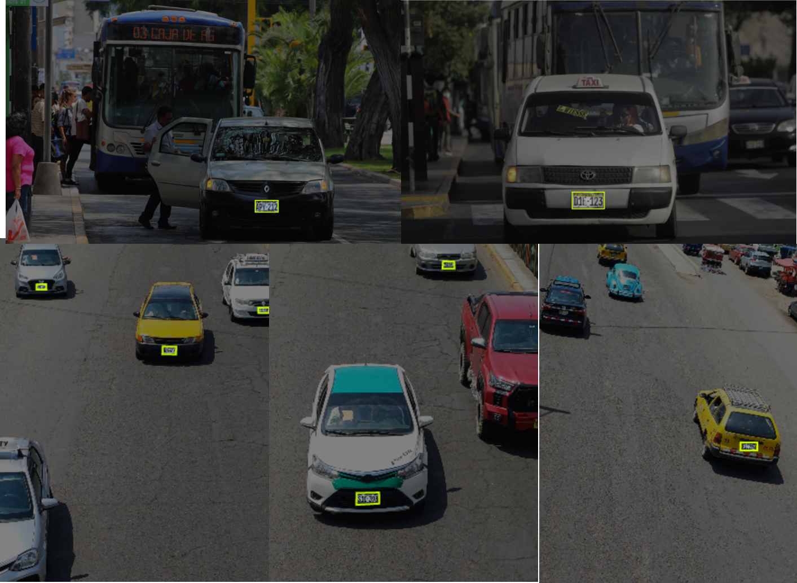
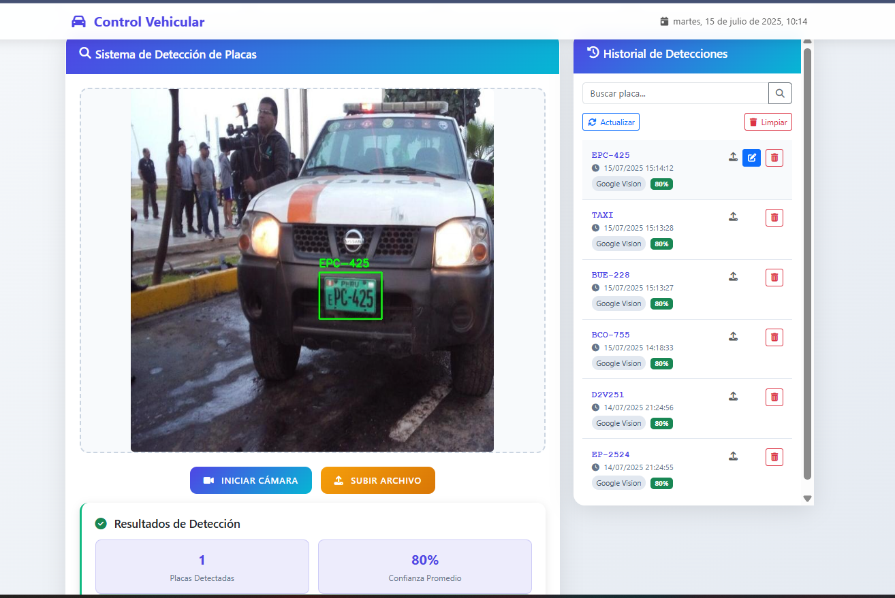
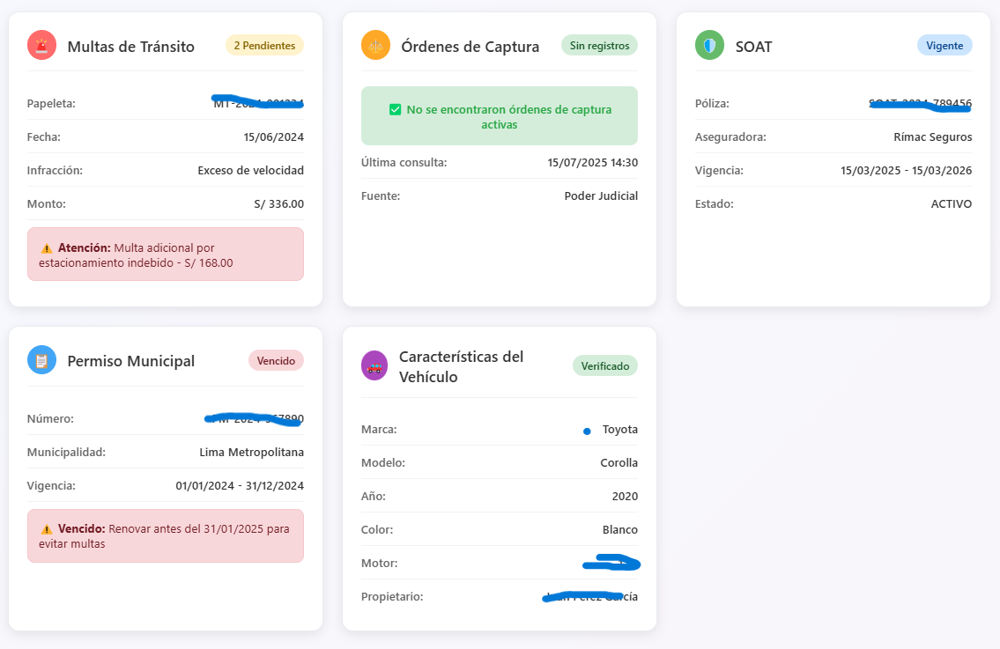
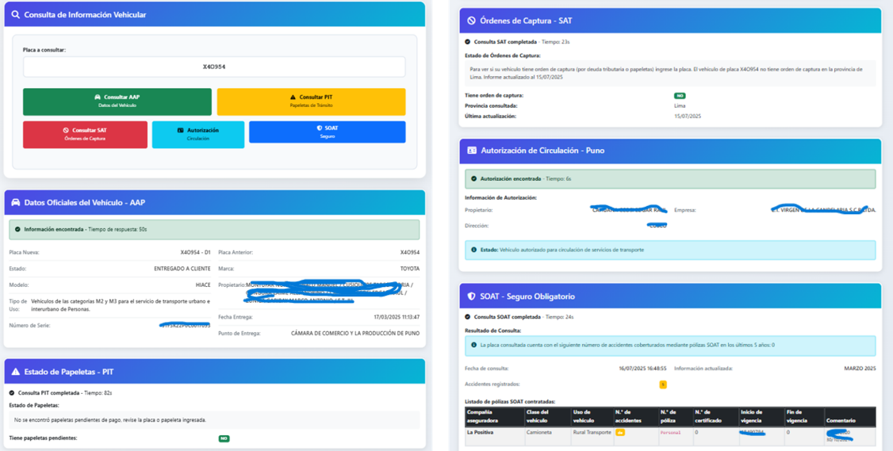

# 🚘 Sistema Automatizado de Detección y Verificación de Placas Vehiculares

Este proyecto implementa un sistema en **Django** para la detección y verificación de placas vehiculares, integrando técnicas de visión por computadora, reconocimiento óptico de caracteres (OCR) y web scraping.  

El objetivo es proporcionar una solución que no solo detecte matrículas en imágenes o video, sino que además valide en tiempo real la información legal asociada a los vehículos en portales oficiales.

---

## ✨ Características principales
- 📷 **Detección de placas vehiculares** con un modelo **YOLOv** entrenado en Roboflow con una precision del 89.7%.  
- 🔤 **Reconocimiento automático de caracteres (OCR)** utilizando la **API de Google Cloud Vision**.  
- 🌐 **Web scraping** en portales oficiales.

- 🖥️ **Interfaz web en Django** para subir imágenes, videos o usar cámara en tiempo real.  
- 📊 **Visualización estructurada** de los resultados de la detección, OCR y scraping.  

---

## ⚙️ Tecnologías utilizadas
- [Python 3.10+](https://www.python.org/)  
- [Django](https://www.djangoproject.com/)  
- [YOLOv8 (Ultralytics)](https://docs.ultralytics.com/) para detección de objetos.  
- [Google Cloud Vision API](https://cloud.google.com/vision) para OCR.  
- [BeautifulSoup4](https://www.crummy.com/software/BeautifulSoup/) y [Requests](https://requests.readthedocs.io/) para scraping.  
- [OpenCV](https://opencv.org/) para procesamiento de imágenes y video.  

---

## 🤖 Resultados
# Funcionamiento de la deteccion de placa (mapeo de la ubicacion de la placa).
📸 ****

# control principal (tiempo real, video grabado o imagen).
📸 ****

# Resultados del webScraping
📸 ****
📸 ****
